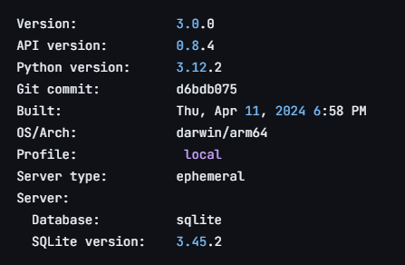
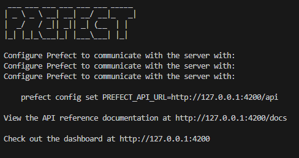
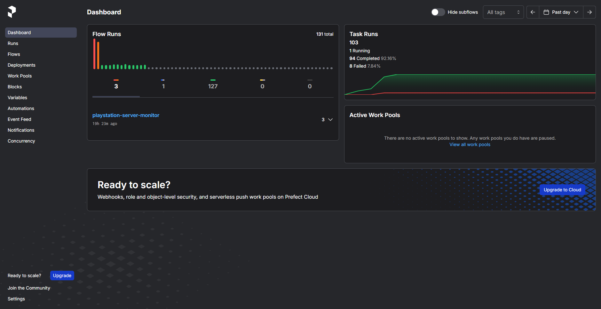
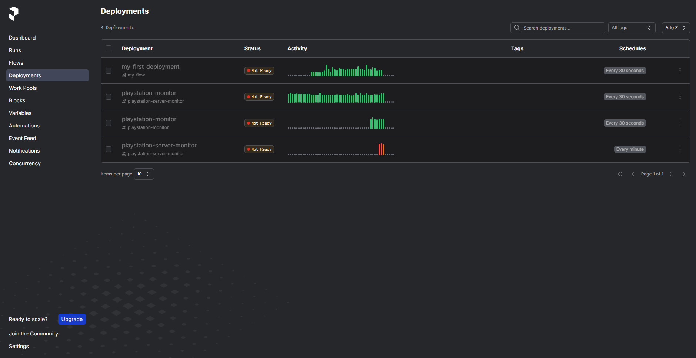
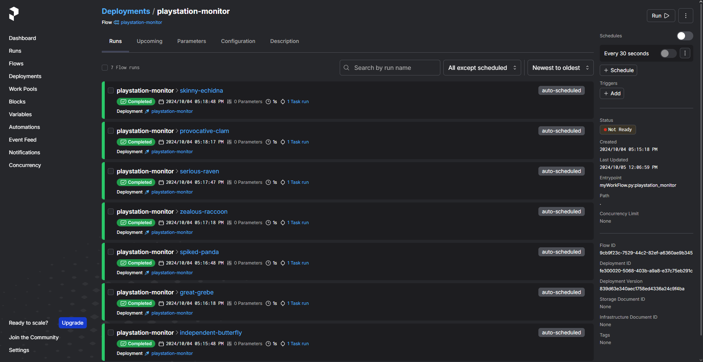
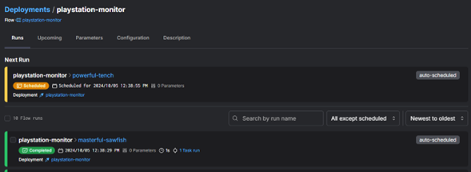
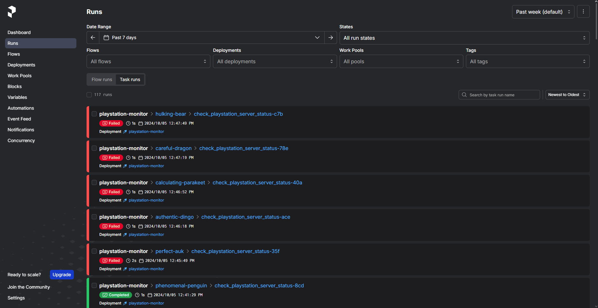

# Workflow-Manager
 Script en Python para monitorear el estado de los servicios de PlayStation utilizando Prefect.

## Instalación Prefect
Para comenzar primero necesitamos instalar la herramienta Prefect usando pip. Se
recomienda utilizar un entorno virtual en Python:
```bash
pip install -U prefect
```
Para confirmar que Prefect fue instalado correctamente, usamos este comando:
```bash
prefect version
```
Después deberiamos poder ver algo similar a esto:



Una vez hecho esto, iniciaremos un servidor API local:
```bash
prefect server start
```
Nos deberá aparecer este mensaje el cual nos da un enlace directo que abrirá el dashboard del servidor en el navegador:



## Prefect Server
Veremos el dashboard en el navegador:



Esta herramienta contiene muchas funciones las cuales no describiré, solamente me enfocaré en lo que utilicé para crear el ejemplo.
Para fines de prueba, usé esta biblioteca en Python para simular respuestas de un servidor no disponible:
```bash
pip install responses
```
En el dashboard tenemos una opción llamada Deployments en la cual podemos monitorear todas las implementaciones que hemos hecho utilizando el servidor, en este caso creé una implementación llamada playstation-monitor la cual deberá aparecer en el dashboard.



Vendría siendo la tercera en la lista.
De momento esta como "Not Ready" ya que aun no he ejecutado el script en Python para que comience a funcionar.
En esta misma función del dashboard podemos modificar las implementaciones con interfaz, podemos ajustar cada implementación como queramos.



En la imagen podemos observar las pruebas que he estado haciendo, así como la opción de ajustar el intervalo de tiempo, ajustes generales, etc.

### Nota:
Si es la primera vez que creas una implementación, por lógica, la implementación no se mostrará en el dashboard hasta que ejecutes el script.


Una vez ejecutemos el script, podremos ver mensajes en la consola, así como la implementación en Deployments en el servidor del navegador.



Podemos ver que la tarea ha sido completada correctamente y que hay otra programada para ejecutarse dentro de unos segundos (30).
Así podremos tener control sobre los servicios de PlayStation, ya que cada cierto tiempo el servidor estará monitoreando su estado. 
Para el caso contrario, utilizaré la biblioteca responses para simular una caída del servidor.


Podemos ver que el flujo se creó y funciona correctamente.
También lo podemos comprobar en el dashboard.


